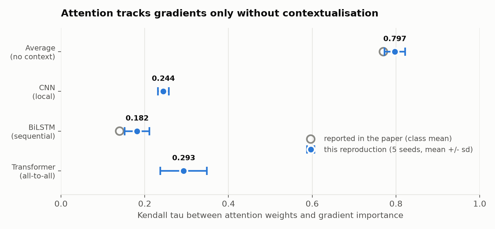
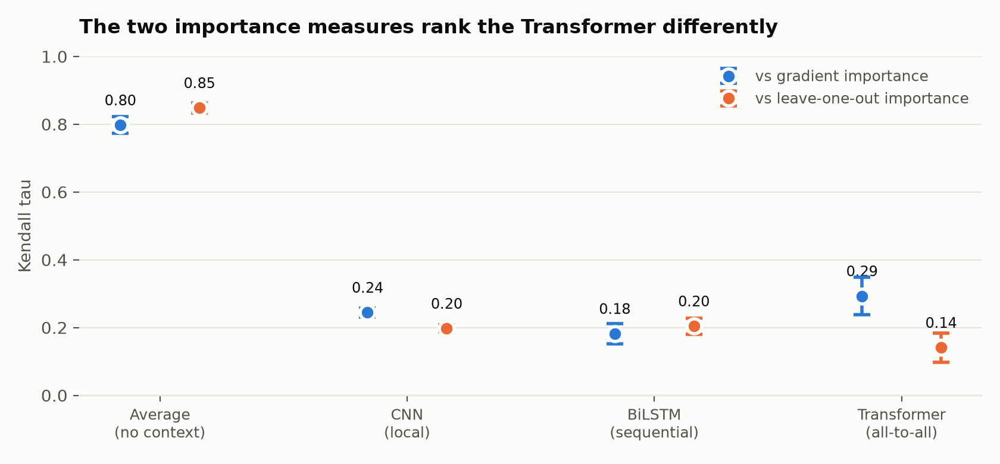

# attention-explanation-lab

<!-- Badges go live after the first push and first CI run. Same set as
     rag-eval-lab and daily-climate-pipeline. -->
[](LICENSE)
[](pyproject.toml)
[](tests/)
[](#running-it)

**Jain and Wallace showed attention weights correlate weakly with feature importance
under a BiLSTM encoder. Their own table shows the correlation nearly doubles when the
encoder does not contextualise at all. So where does a Transformer land?**

This repository reproduces *Attention is not Explanation* (Jain & Wallace, NAACL 2019)
and then answers a question the paper left open: it tested BiLSTM, CNN and average
embedding encoders, and explicitly excluded self-attention architectures. Seven years
later, the encoder everyone actually uses is the one that was never measured.

---

## The observation the extension is built on

Table 2 of the paper reports Kendall's tau between attention weights and gradient-based
feature importance. Reading it by encoder rather than by dataset:

| Dataset | BiLSTM tau_g | Average tau_g | Gap |
|---|---|---|---|
| SST | 0.34 / 0.36 | 0.61 / 0.60 | +0.26 |
| IMDB | 0.44 / 0.43 | 0.67 / 0.68 | +0.24 |
| 20 News | 0.07 / 0.21 | 0.79 / 0.75 | +0.63 |
| AG News | 0.36 / 0.42 | 0.78 / 0.76 | +0.40 |

The authors state the effect in one sentence: gradients in average embedding models
show "very high degree of correspondence" with attention, roughly **0.375 higher on
average** than for the BiLSTM. They attribute it to contextualisation. A BiLSTM hidden
state at position *t* already contains the whole sentence, so attending to position *t*
is not the same as using token *t*.

**That is a claim with a direction.** If contextualisation is what breaks the
correspondence, then a Transformer encoder, where every position mixes with every other
at every layer, should break it further. If instead the correlation recovers, the
explanation is wrong and something else is going on.

Nobody has to guess. It is measurable, on the paper's own datasets, with the paper's own
metric.

---

## What is reproduced

Both experiments from the original paper, on a subset of its datasets (SST, IMDB,
AG News, 20 Newsgroups):

**Experiment 1, correlation.** Kendall's tau between attention weights and (a)
gradient-based importance, (b) leave-one-out importance. The gradient is computed with
the computation graph cut at the attention module, as the paper specifies in Appendix B,
so attention is treated as a separate input and the gradient does not flow through it.

**Experiment 2, counterfactual attention.** Attention permutation (100 permutations per
instance, median total variation distance in output) and adversarial attention, which
maximises Jensen-Shannon divergence from the observed distribution subject to the output
moving by less than epsilon. Epsilon is 0.01 for classification, as in the paper.

Model configuration follows Appendix A exactly: embedding size 300, BiLSTM hidden size
128, additive (Bahdanau) attention, L2 regularisation at 1e-5, Adam with PyTorch
defaults, spaCy tokenisation, numeric tokens mapped to `qqq`.

## What is added

| Addition | Why |
|---|---|
| **Transformer encoder** | The gap in the original. Same attention head, same metrics, only the encoder changes. |
| **Five seeds per configuration** | The original reports single runs. The rebuttal (Wiegreffe & Pinter, EMNLP 2019) makes seed variance one of its four objections, so it is built in here rather than added later. |
| **Correlation as a function of contextualisation** | Average, CNN, BiLSTM, Transformer on one axis. This is the actual result of the extension. |

---

## Results

Regenerated by `python -m src.report --write`. Nothing below this line is typed
by hand.

### Reproduction: Kendall tau between attention and gradient importance

<!-- BEGIN GENERATED: reproduction -->
| Dataset | Encoder | Seeds | Accuracy | tau_g (this repo) | tau_g (paper) |
|---|---|---|---|---|---|
| 20news | average | 5 | 0.756 | 0.797 +/- 0.024 | 0.79 / 0.75 |
| 20news | bilstm | 5 | 0.763 | 0.182 +/- 0.029 | 0.07 / 0.21 |
<!-- END GENERATED: reproduction -->

### Extension: where the Transformer falls

<!-- BEGIN GENERATED: extension -->
| Dataset | average | cnn | bilstm | transformer |
|---|---|---|---|---|
| 20news | 0.797 +/- 0.024 | 0.244 +/- 0.013 | 0.182 +/- 0.029 | 0.293 +/- 0.056 |
<!-- END GENERATED: extension -->

### What the numbers do not establish

<!-- BEGIN GENERATED: notes -->
- **20news**: `cnn` and `transformer` overlap within one standard deviation across seeds and are reported as indistinguishable.
<!-- END GENERATED: notes -->

---

## Figure 1: the reproduction, and where the Transformer lands

<picture>
  <source media="(prefers-color-scheme: dark)" srcset="figures/tau_by_encoder_20news_dark.png">
  
</picture>

The grey rings are the paper's own numbers. Where they exist, the measurement lands
on them: **0.797 against 0.79 / 0.75 for the average encoder, 0.182 against
0.07 / 0.21 for the BiLSTM.** Leave-one-out reproduces too, at 0.204 against the
paper's 0.06 / 0.20. The reproduction succeeds on both measures, which is what
licenses reading anything into the encoder that has no grey ring.

## Figure 2: the two importance measures disagree, but only about one encoder

<picture>
  <source media="(prefers-color-scheme: dark)" srcset="figures/two_measures_20news_dark.png">
  
</picture>

## What the numbers say

**The paper's headline effect is large and it replicates.** An encoder that never
mixes positions agrees with gradient importance at 0.797. Every encoder that does
mix falls to 0.29 or below. That gap, more than four to one, is the paper's claim
and it is not fragile: the spread across five seeds is 0.024 at the top and 0.029
at the bottom, so the intervals are nowhere near touching.

**But the effect is not monotone in how much the encoder mixes, which is the
explanation the paper offers.** If contextualisation alone drove the correlation
down, the ordering would follow the amount of mixing: average, then CNN with its
seven-token window, then BiLSTM over the sequence, then the Transformer, which
attends to everything at every layer. It does not. On gradient importance the
Transformer sits at 0.293, **above** the BiLSTM's 0.182, and the two intervals do
not overlap. The BiLSTM is the low point, not the endpoint of a trend.

**And the two importance measures rank the Transformer in opposite directions.**
For three of the four encoders they agree closely: 0.80 against 0.85 for average,
0.24 against 0.20 for the CNN, 0.18 against 0.20 for the BiLSTM. For the
Transformer, gradient gives 0.29 and leave-one-out gives 0.14, and it moves from
the highest of the three contextualising encoders on one measure to the lowest on
the other.

### A hypothesis, tested, and not supported

The obvious explanation is the residual stream. A Transformer keeps a direct additive
path from the embedding at position *t* to the hidden state at position *t*, so a
gradient taken with respect to that embedding travels that path and stays partly
aligned with attention. Deleting the token is a different intervention: through
self-attention it perturbs every position at once, so the change in output is diffuse
rather than localised. Recurrence and convolution mix less globally, so deletion stays
local for them and the two measures keep agreeing.

That story fits the numbers. It also makes two predictions, and this repository ran
both rather than leaving them as a paragraph.

**Prediction 1: remove the residual connections and the two measures converge.**
`nn.TransformerEncoderLayer` bakes them in, so the block was rewritten by hand with a
switch. The result is **not a negative result, it is a failed experiment**:

| | accuracy | tau_gradient | tau_loo |
|---|---|---|---|
| `transformer_nores`, 2 layers | **0.501** | NaN | NaN |

0.501 on a balanced binary task is chance. Without the residual connections the stack
does not converge, the predictions go constant, the importances go constant, and
Kendall tau is undefined. The ablation measured nothing at all, in either direction.
A single-layer control, `transformer_l1_nores`, is the minimal architecture in which
the ablation could still converge and is the next thing to run.

**Prediction 2: the gap should widen with depth.** It narrows.

| | accuracy | tau_gradient | tau_loo | gap |
|---|---|---|---|---|
| `transformer_l1` | 0.744 | 0.302 +/- 0.061 | 0.135 +/- 0.050 | +0.167 |
| `transformer` (2 layers) | 0.750 | 0.293 +/- 0.056 | 0.141 +/- 0.043 | +0.152 |
| `transformer_l4` | 0.702 | 0.151 +/- 0.099 | 0.072 +/- 0.072 | +0.079 |

And the four-layer model cannot carry that conclusion either: it reaches 0.702 against
0.744 and 0.750, with a standard deviation of 0.099 on tau_gradient. Depth is
confounded with how well the model trained, so this does not establish that depth
narrows the gap. It only establishes that the prediction failed.

**So the residual-stream explanation is not supported by anything here.** One test did
not run and the other went the wrong way. The hypothesis is left in this README
because the experiments that killed it are worth more than a clean story, not because
it survived.

### What does survive

The gap itself is robust. Across five seeds, the three non-Transformer encoders sit
between -0.05 and +0.05 between the two importance measures, and every Transformer
that actually trained sits near +0.15. That holds at one layer and at two, and it is
not an artefact of depth or of undertraining. **The Transformer is the only encoder
here for which the choice of importance measure changes the answer.** Why, remains
open.

## What this does not establish

- **One dataset, one task, one attention form.** 20 Newsgroups, binary
  classification, additive attention. The paper spans nine corpora and three tasks.
  SST is loaded and checksummed but not yet measured.
- **The CNN underfits.** It reaches 0.689 accuracy against 0.75 to 0.76 for the
  others, so its correlations describe a weaker model and are not directly
  comparable.
- **`cnn` and `transformer` overlap on gradient importance** within one standard
  deviation across seeds, so they are not ranked against each other.
- **Gradients are not ground truth.** The paper says so itself, and the argument is
  not that attention is wrong but that it agrees poorly with several independent
  measures of importance. A low correlation is evidence about that agreement, not
  about what the model used.
- **Measurement, not significance testing.** Five seeds and 300 test instances per
  run give a spread, not a p-value on the difference between two encoders.


---

## Running it

```bash
pip install -r requirements.txt
python -m src.data 20news                      # fetch once, record the checksum
python -m src.experiment --dataset 20news --encoder all --seeds 5
python -m src.report --write                   # regenerates every table above
```

Seeds are fixed, versions are pinned, and no number in this README is typed by hand.

## The papers

- Jain, S., & Wallace, B. C. (2019). *Attention is not Explanation.* NAACL-HLT.
  [aclanthology.org/N19-1357](https://aclanthology.org/N19-1357/) ·
  [code](https://github.com/successar/AttentionExplanation)
- Wiegreffe, S., & Pinter, Y. (2019). *Attention is not not Explanation.* EMNLP.
  [aclanthology.org/D19-1002](https://aclanthology.org/D19-1002/) ·
  [code](https://github.com/sarahwie/attention)
